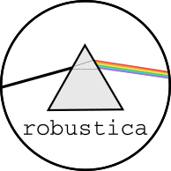

# `robustica`



Fully customizable robust Independent Component Analysis (ICA).

[](https://pypi.python.org/pypi/robustica)
[](https://opensource.org/licenses/BSD-3-Clause)

## Description
This package contains 3 modules:
- `RobustICA`

    Defines the most important class that allows to perform and customize robust independent component analysis.
    
- `InferComponents`

    Retrieves the number of components that explain a user-defined percentage of variance.

- `examples`
    
    Contains handy functions to quickly create or access example datasets.

A more user-friendly documentation can be found at https://crg-cnag.github.io/robustica/.

## Requirements
In brackets, versions of packages used to develop `robustica`.
- `numpy` (1.19.2)
- `pandas` (1.1.2)
- `scipy` (1.6.2)
- `scikit-learn` (0.23.2)
- `scikit-learn-extra` (0.2.0)
- `joblib` (1.0.1)
- `tqdm` (4.59.0)

## Installation
### [required if numpy>2.0] `scikit-learn-extra` incompatibility
Install a forked version first to avoid incompatibility with the newest `numpy` (see [#6](https://github.com/CRG-CNAG/robustica/issues/6) for more info on this).
```shell
pip install git+https://github.com/TimotheeMathieu/scikit-learn-extra
```
### pip
```shell
pip install robustica
```
### local (latest version)
```shell
git clone https://github.com/CRG-CNAG/robustica
cd robustica
pip install -e .
```

## Usage
```python
from robustica import RobustICA
from robustica.examples import make_sampledata

X = make_sampledata(ncol=300, nrow=2000, seed=123)

rica = RobustICA(n_components=10)
# note that by default, we use DBSCAN algorithm and the number of components can be smaller
# than the number of components defined.
S, A = rica.fit_transform(X)

# source matrix (nrow x n_components)
print(S.shape)
print(S)
```
```shell
(2000, 3) 
[[ 0.00975714  0.00619138  0.00502649]
 [-0.0021527  -0.0376857   0.0117938 ]
 [ 0.00046302  0.01712561  0.00518039]
 ...
 [ 0.00128344 -0.00767099  0.0047334 ]
 [ 0.00644422 -0.00498327  0.01325542]
 [ 0.0017873  -0.01739889 -0.00445954]]
```
```python
# mixing matrix (ncol x n_components)
print(A.shape)
print(A)
```
```shell
(300, 3)
[[-1.79503194e-02 -1.05611924e+00  5.36688700e-01]
 [ 1.03342514e-01  7.43471382e-02  4.90472157e-01]
 [ 4.89753256e-01 -1.11300905e+00 -7.55809647e-01]
 ...
 [ 4.30468472e-01 -4.87992838e-01 -7.77965512e-01]
 [ 3.44078031e-02  4.09029805e-01 -7.29076312e-01]
 [ 2.15557427e-02  2.89301273e-01 -2.96690459e-01]]
```

## Tutorials
- [Basic pipeline for exploratory analysis](https://crg-cnag.github.io/robustica/basics.html)
- [Using a custom clustering class](https://crg-cnag.github.io/robustica/customize_clustering.html)
- [Inferring the number of components](https://crg-cnag.github.io/robustica/infer_components.html)


## Contact
This project has been fully developed at the [Centre for Genomic Regulation](https://www.crg.eu/) within the group of [Design of Biological Systems](https://www.crg.eu/en/luis_serrano)

Please, report any issues that you experience through this repository's ["Issues"](https://github.com/CRG-CNAG/robustica/issues) or email:
- [Miquel Anglada-Girotto](mailto:miquel.anglada@crg.eu)
- [Sarah A. Head](mailto:sarah.dibartolo@crg.eu)
- [Luis Serrano](mailto:luis.serrano@crg.eu)

## License

`robustica` is distributed under a BSD 3-Clause License (see [LICENSE](https://github.com/CRG-CNAG/robustica/blob/main/LICENSE)).

## Citation
*Anglada-Girotto, M., Miravet-Verde, S., Serrano, L., Head, S. A.*. "*robustica*: customizable robust independent component analysis". BMC Bioinformatics 23, 519 (2022). DOI: https://doi.org/10.1186/s12859-022-05043-9

## References
- *Himberg, J., & Hyvarinen, A.* "Icasso: software for investigating the reliability of ICA estimates by clustering and visualization". IEEE XIII Workshop on Neural Networks for Signal Processing (2003). DOI: https://doi.org/10.1109/NNSP.2003.1318025
- *Sastry, Anand V., et al.* "The Escherichia coli transcriptome mostly consists of independently regulated modules." Nature communications 10.1 (2019): 1-14. DOI: https://doi.org/10.1038/s41467-019-13483-w
- *Kairov, U., Cantini, L., Greco, A. et al.* Determining the optimal number of independent components for reproducible transcriptomic data analysis. BMC Genomics 18, 712 (2017). DOI: https://doi.org/10.1186/s12864-017-4112-9
